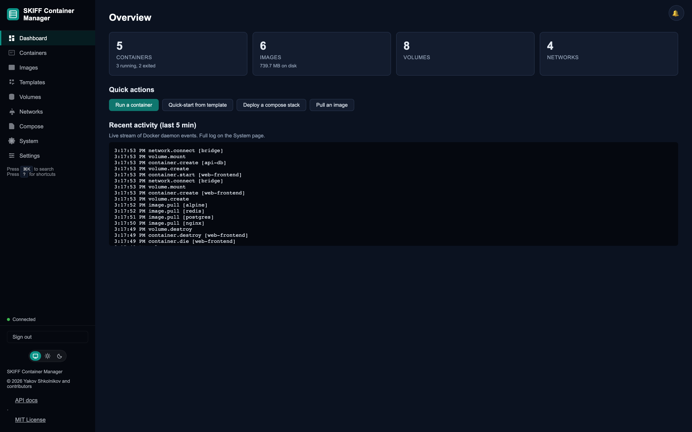
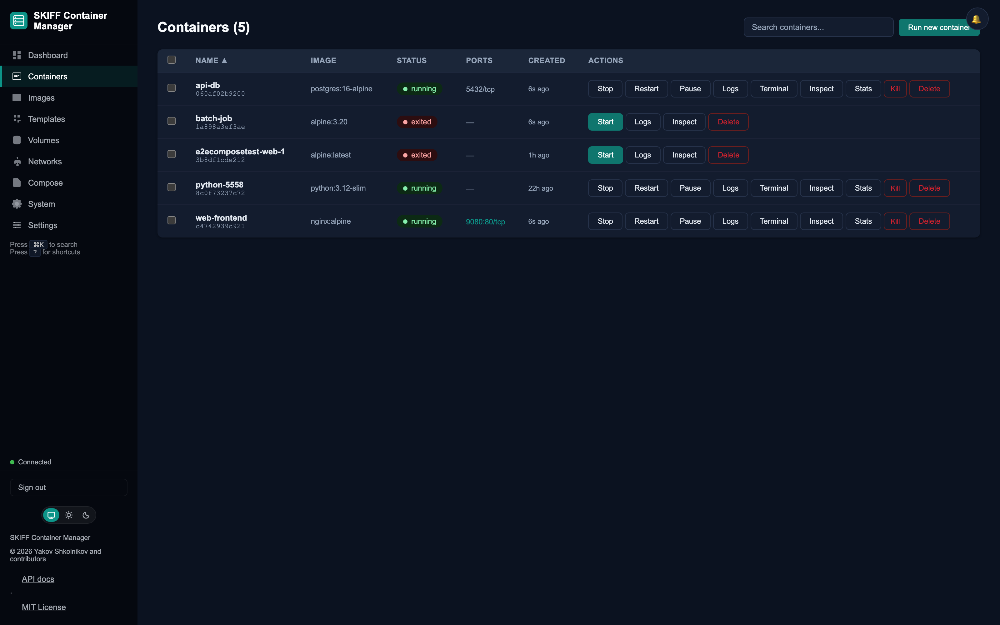
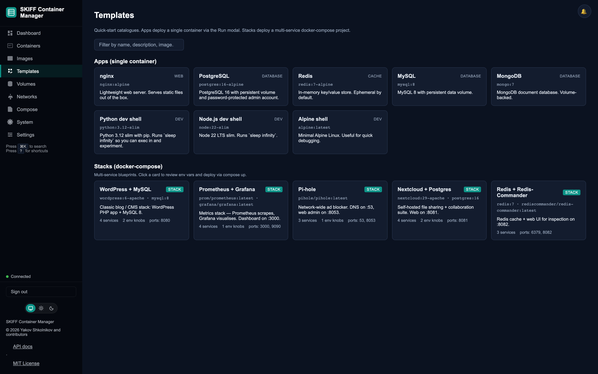
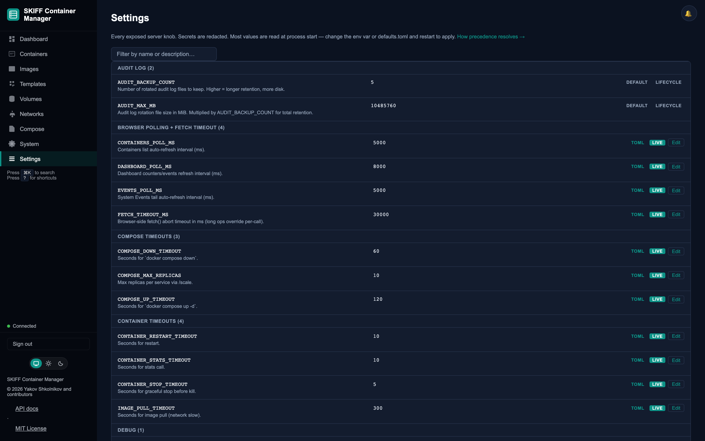

# SKIFF Container Manager

A lightweight web UI and JSON API for the Docker Engine API — works locally against any runtime that speaks the Docker API (Docker Engine, Podman, Colima, OrbStack, Rancher Desktop), or remotely via SSH tunnel. No agent, no daemon, no install on the container host.

Registry allowlists, compose sandbox validation, structured audit log, WebSocket log & terminal streaming, first-run setup wizard, undo queue for destructive actions, and a browser UI that keeps the bearer token in `sessionStorage` only (the browser drops it when the tab closes). MIT-licensed.










---

## Why SKIFF?

SKIFF talks to any container daemon that speaks the Docker API: local sockets (Docker Engine, Podman, Colima, OrbStack, Rancher Desktop) or SSH-tunnelled remote sockets. It runs as a plain Python process on the operator's own host — no always-on management plane, no agent on the container host.

Common alternatives fall into two patterns: **desktop GUIs** that bundle their own daemon and read `docker.sock` from the operator's machine; and **server-based managers** that run as a container on the container host and reach the daemon by mounting `/var/run/docker.sock` into their own process. Each fits its niche; SKIFF fits a different one:

- **No bind-mounted `docker.sock` in another process.** Mounting the socket into a container grants that container the ability to create privileged containers and escape to the host filesystem. SKIFF doesn't mount the socket anywhere — the operator's Python process talks to the socket directly, whether local or SSH-forwarded.
- **No always-on management plane.** A server-based manager needs a dedicated process or VM running 24/7. SKIFF starts when needed and stops when done.
- **No nested virtualisation required.** Cloud workstations are already VMs. Running containers *inside* them requires nested virt, which not every SKU supports. SKIFF runs natively on the workstation and tunnels to the container host over SSH.

| Concern | Desktop GUI pattern | Server-based manager pattern | SKIFF |
|---|---|---|---|
| Where it runs | Operator's laptop | On the container host (as a container) | Operator's machine (laptop or jump host) |
| `docker.sock` exposure | Read locally by the GUI | Bind-mounted into the manager container | Same socket SKIFF's operator can reach — local OR SSH-forwarded. Never bind-mounted into another container. |
| Always-on cost | While the GUI app is open | Dedicated management VM / container | Start when needed, stop when done |
| Registry controls | Varies | Varies | Allowlist enforced server-side (see `ALLOWED_REGISTRIES`) |
| Agent on container host | N/A | Required for remote hosts | None — SSH tunnel is the transport |
| Per-user identity | Usually single-user | Some offer built-in RBAC | Single shared bearer token by default; front it with an [SSO proxy](docs/hardening/production.md#5-sso-via-identity-proxy-optional-multi-user) for per-user identity |
| License / price | Varies by vendor | Varies by vendor | MIT, free |

This is a positioning note, not a ranking — the right tool depends on where you run the daemon and who needs to reach it. SKIFF is **not** a drop-in replacement for desktop runtimes (it does not ship a daemon) and it does not replicate every capability of mature server-based managers (it is single-operator by default, with no built-in per-user RBAC).

### Zero-trust-compatible deployment

SKIFF is designed to slot into a zero-trust deployment without itself being a trust anchor. There is no persistent management process on the container host: access is established per-session over SSH, and identity is handled by whatever your organisation already runs in front of SKIFF — IAP, BeyondCorp, SSH certificates, or any OIDC-aware proxy (see [`docs/hardening/production.md`](docs/hardening/production.md)). SKIFF enforces its own guardrails at the API layer — registry allowlist, compose sandbox validator, structured audit log, rate limiting, reviewer-mode profile — independent of who is connected.

Known gaps (full list in [`SECURITY.md`](SECURITY.md)) include a shared bearer token (no built-in per-user invalidation without an SSO proxy) and a mutable `ALLOWED_REGISTRIES` list during runtime configuration. SKIFF ships **no warranty, no uptime guarantee, no compliance certification** — it is a community project licensed under MIT; see [`LICENSE`](LICENSE).

---

## Features

### Pages

- **Dashboard** — per-state container counts, image / volume / network totals, disk usage, live stream of the most recent Docker events, quick-action buttons for the most common starts
- **Containers** — list, run, start, stop, restart, pause, unpause, kill, rename, remove (with undo), commit to image, bulk-select actions, right-click context menu, detail tabs (Logs, Terminal, Inspect, Stats, Processes, Files)
- **Images** — list, pull, tag, push (to allowlisted registries), delete, inspect, history, search Docker Hub + tag lookup, prune
- **Templates** — one-click catalogue of single-container **Apps** (nginx, postgres, redis, mysql, mongo, python/node/alpine dev shells) and multi-service **Stacks** (WordPress + MySQL, Prometheus + Grafana, Pi-hole, Nextcloud + Postgres, Redis + Redis-Commander)
- **Volumes** — list, create (driver / labels / driver_opts), delete, prune, inspect, live filesystem browse for named volumes
- **Networks** — list, create (subnet / gateway / labels / internal / attachable / ipv6), delete, connect / disconnect containers, prune
- **Compose** — upload YAML, deploy, per-stack start / stop / restart / pull / scale, download the deployed YAML back, view aggregated logs, teardown (with undo)
- **System** — engine info, disk usage, system prune, build-cache prune, live Docker events stream, filterable audit-log viewer (on-disk JSONL)
- **Settings** — every runtime knob surfaced, grouped by category (polling, timeouts, limits, rate limits, audit, debug); safe knobs are live-editable from the browser, the rest are marked TOML-only with their source

### Cross-cutting capabilities

- **Files tab on every container** — live filesystem browser (wraps `docker cp` server-side): navigate, download any file, drag-drop upload, delete, plus the classic `docker diff` view
- **Logs** — tail, search, download (`.log` and `.jsonl`), stream via WebSocket with reconnect on idle
- **Terminal** — xterm.js interactive exec over WebSocket; survives detail-tab switches so you don't lose your shell
- **Notifications** — every toast mirrored into a bell-icon history panel (last 50)
- **Command palette** — press **⌘K** (macOS) or **Ctrl+K** elsewhere to jump to any page or container by name from anywhere in the app; press **?** for the keyboard-shortcut list
- **Themes** — three-state toggle (System / Light / Dark), rendered inline so it survives strict CSP
- **First-run tour** — 4-step walkthrough on first login, skippable, remembered in localStorage
- **Undo queue** — destructive actions (container delete, compose down, volume delete, network delete, image delete) return an undo token; the effect is deferred briefly so a single click or banner undoes it

### Security + auditability

- Bearer-token auth with CSRF (`X-Requested-With: ContainerManager` on all mutations)
- Rate limiting (per-IP, per-route classes), WebSocket auth handshake with per-IP lockout
- Registry allowlist enforced server-side for pulls, pushes, compose images, and templates
- Compose validator rejects bind mounts of host paths, privileged containers, cap adds, non-allowlisted images
- Strict CSP (no inline scripts / styles), security headers, audit-log redaction for env vars matching `SECRET`/`PASSWORD`/`KEY` patterns
- Reviewer-mode profile — one-way latch into a read-only session so you can hand the browser to someone who should not mutate state
- First-run setup wizard with a 5-minute claim window, per-IP attempt limits, SSH ControlMaster tunnel option
- Structured JSONL audit log (rotating) with optional GCP Cloud Logging sink

---

## Prerequisites

| Requirement | Minimum | Notes |
|---|---|---|
| Python | 3.12+ | |
| Docker CLI or compatible | 24+ | Needed for compose commands (SKIFF shells out to `docker compose`) |
| Docker Engine or compatible | 24+ | Local socket or SSH-forwarded remote |
| pip / venv | any | `run.sh` creates a venv automatically |

---

## Quick start

> **First-run setup window — know before you boot.** If `API_TOKEN` is unset at startup, SKIFF opens a **5-minute first-run wizard** on `BIND_HOST:PORT` (default `127.0.0.1:8080`). Anyone who can reach that socket during the window can claim the instance with their own token. Fine on a single-user workstation (only you can reach localhost). On a shared or remote host, **pre-set `API_TOKEN` in the environment before starting** — the wizard stays closed and the server logs `from_env=true`. See [SECURITY.md § First-run setup window](SECURITY.md#first-run-setup-window-wizard-race) and [`docs/hardening/production.md § setup-window`](docs/hardening/production.md#setup-window).

### Local use (Colima / OrbStack / Rancher Desktop / Docker Engine / Podman)

```bash
git clone https://github.com/yshk-mxim/skiff-container-manager skiff
cd skiff
cp .env.example .env   # DOCKER_HOST is pre-filled; leave API_TOKEN empty only when binding to 127.0.0.1
./run.sh
# Opens http://127.0.0.1:8080
```

`run.sh` creates a `.venv/` virtual environment and installs runtime dependencies automatically. This is the one-command path for **running** SKIFF. If you intend to **develop** SKIFF (run tests, contribute), follow [`CONTRIBUTING.md`](CONTRIBUTING.md) instead — it uses `pip install -e ".[dev]"` so test deps are included.

### Platform socket paths

| Runtime | `DOCKER_HOST` value |
|---|---|
| Mac/Win default socket | `unix:///var/run/docker.sock` |
| Colima | `unix://$HOME/.colima/default/docker.sock` |
| OrbStack | `unix:///var/run/docker.sock` |
| Rancher Desktop | `unix://$HOME/.rd/docker.sock` |
| Linux Docker Engine | `unix:///var/run/docker.sock` |
| Podman (rootless) | `unix:///run/user/$UID/podman/podman.sock` |
| Remote via SSH | `unix:///tmp/docker.sock` (after tunnel — see [Remote deployment](#remote-deployment)) |

### Alternative: install from git without cloning

```bash
pip install git+https://github.com/yshk-mxim/skiff-container-manager

export API_TOKEN="$(openssl rand -hex 32)"
export DOCKER_HOST="unix:///var/run/docker.sock"
skiff
# Opens http://127.0.0.1:8080
```

### Remote deployment

For SSH tunnel setup (remote VMs, GCP Cloud Workstations, EC2, bare metal):

```bash
# Forward the remote socket
ssh -fNL /tmp/docker.sock:/var/run/docker.sock user@docker-host

export API_TOKEN="$(openssl rand -hex 32)"
export DOCKER_HOST="unix:///tmp/docker.sock"
./run.sh
```

The first-run wizard can also open and manage this tunnel for you via SSH ControlMaster — see `docs/deployment.md` for the managed-tunnel flow, systemd configuration, and environment variable reference.

### Insecure dev mode (localhost only)

If you just want to click around the UI on your own machine and don't care about auth:

```bash
API_TOKEN="" uvicorn skiff.app:app --host 127.0.0.1 --port 8080 --no-proxy-headers
```

Do **not** use this with `BIND_HOST` other than `127.0.0.1`. Anyone who can reach the socket can use the UI.

---

## Configuration

Copy `.env.example` to `.env` and edit. All values can also be set as environment variables directly. A much larger set of runtime knobs (polling intervals, timeouts, limits, rate-limit floors) is exposed on the **Settings** page — safe knobs are live-editable, the rest are marked TOML-only.

| Variable | Default | Description |
|---|---|---|
| `API_TOKEN` | _(none)_ | Bearer token for API auth. Leave unset only for local dev. |
| `DOCKER_HOST` | `unix:///var/run/docker.sock` | Socket path for the container daemon. Recognised by any Docker-API-compatible runtime. |
| `ALLOWED_REGISTRIES` | `docker.io,ghcr.io` | Comma-separated registry prefixes. Images outside these are rejected. Empty = allow all (dev only). |
| `ALLOWED_ORIGINS` | `http://127.0.0.1:8080` | Comma-separated CORS origins. |
| `BIND_HOST` | `127.0.0.1` | Address uvicorn listens on. |
| `PORT` | `8080` | Port uvicorn listens on (run.sh only). |
| `DOCKER_VM_HOST` | _(empty)_ | Hostname shown for container port links in the UI. |
| `COMPOSE_DIR` | per-user state dir | Where uploaded compose YAML files live (e.g. `~/Library/Application Support/skiff/compose/` on macOS). |
| `AUDIT_LOG` | per-user state dir | Audit log path. Override in production with a fixed path such as `/var/log/skiff-audit.jsonl`. |
| `AUDIT_MAX_MB` | `10` | Max size per audit log file in MB. |
| `AUDIT_BACKUP_COUNT` | `5` | Number of rotated audit log files to keep. Total retention ≈ `AUDIT_MAX_MB × AUDIT_BACKUP_COUNT`. |
| `GOOGLE_CLOUD_PROJECT` | _(empty)_ | When set (and `skiff-container-manager[gcp]` is installed) all audit entries are dual-written to GCP Cloud Logging. |
| `GCP_LOG_NAME` | `skiff-audit` | Cloud Logging log name. |
| `RATE_LIMIT_SCALE` | `1` | Multiply all rate limits by this factor (1..100). |
| `PROFILE` | _(empty)_ | One of `homelab`, `dev`, `sre`, `reviewer`, `tutor`, `ci`. Documented bundle of sensible defaults per persona (see [docs/hardening/production.md §14](docs/hardening/production.md#14-profile-presets)). Explicit env vars always win. |

Every knob is documented on the **Settings** page in the UI and in [`docs/config-knobs.md`](docs/config-knobs.md).

---

## API

See [`docs/api-reference.md`](docs/api-reference.md) for the full endpoint reference, or `GET /api/docs` (Swagger UI) on a running server.

| Prefix | Resource |
|---|---|
| `GET /health` · `GET /ready` | Liveness / readiness probes (no auth) |
| `GET /api/auth-required` | Auth config for the UI (no auth) |
| `/api/setup/...`, `POST /api/setup` | First-run wizard (open only during the setup window) |
| `/api/tunnel/...` | Managed SSH tunnel (open / status / reconnect / stop) |
| `/api/auth/rotate-token`, `/api/auth/reset-config` | Token rotation + config reset |
| `/api/containers/...` | Lifecycle (run, start/stop/restart/pause/kill/rename/rm, commit), logs + logs/download, inspect, stats, top, diff, ls, files upload/download/delete, update |
| `/api/images/...` | Pull, tag, push, delete, inspect, prune; `/api/registry/search` + `/api/registry/tags` for Hub discovery; `/api/templates` for the app catalogue |
| `/api/volumes/...` | List, create, delete, prune, inspect; `/api/volumes/{name}/browse` for named-volume filesystem browse |
| `/api/networks/...` | List, create, delete, connect / disconnect, prune |
| `/api/compose/...` | Stacks list, up, down, start, stop, restart service, pull, scale, logs, download YAML; `/api/compose/templates` for stack catalogue |
| `/api/system/...` | Info, metrics (Prometheus), df, overview, events, prune, prune-build-cache |
| `/api/system/audit-log...` | Filterable audit log (view + download) |
| `/api/config`, `/api/config/knobs`, `PUT /api/config/knobs/{name}` | Server config + runtime knob surface |
| `/api/profile/enter-reviewer` | One-way latch into reviewer (read-only) mode |
| `/api/undo/{token}` | Undo a recently-deferred destructive action |
| `WS /ws/logs/{id}` | Stream container logs |
| `WS /ws/exec/{id}` | Interactive shell |

All `/api/` endpoints (except the no-auth probes above) require `Authorization: Bearer <token>`. Mutating endpoints (`POST`, `PUT`, `DELETE`) also require `X-Requested-With: ContainerManager`.

---

## Deployment (systemd)

A systemd unit file is provided at `docs/skiff.service`. To install:

```bash
sudo cp docs/skiff.service /etc/systemd/system/skiff@.service
sudo systemctl daemon-reload
sudo systemctl enable --now skiff@$USER
sudo journalctl -u skiff@$USER -f
```

The template is per-instance (`skiff@<name>.service`); each instance reads `/opt/skiff/<name>.env`. Enable as `systemctl enable --now skiff@prod.service`, `systemctl enable --now skiff@staging.service`, etc. Each env file sets `PORT`, `DOCKER_HOST`, `API_TOKEN`, and any other per-instance overrides.

---

## Development

```bash
git clone https://github.com/yshk-mxim/skiff-container-manager skiff
cd skiff
python3 -m venv .venv && source .venv/bin/activate

# Unit tests — no container daemon required
pip install -e ".[dev]"
make test-unit

# Run with hot-reload
cp .env.example .env   # set API_TOKEN="" for no-auth dev mode
API_TOKEN="" uvicorn skiff.app:app --reload --host 127.0.0.1 --port 8080 --no-proxy-headers
```

```bash
make lint           # ruff check + ruff format --check
make format         # ruff format + auto-fix
make test-unit      # fast unit tests (no container daemon required)
make coverage       # coverage report (HTML + term-missing, excludes e2e)
make security       # ruff --select S security scan + pip-audit
make docs-check     # fail if any auto-generated doc drifted from source
make ci             # lint + anti-patterns + js + md + asvs + notice + security + docs-check + coverage

# E2E tier (requires pip install -e ".[dev,e2e]" && playwright install chromium, plus a reachable Docker socket):
pytest tests/ -m e2e --timeout=90
```

---

## Security

See [`SECURITY.md`](SECURITY.md) for the security model, design trade-offs, and vulnerability reporting process. See [`docs/hardening/production.md`](docs/hardening/production.md) for the operator deployment and hardening guide (TLS, token rotation, registry scoping, SSO, audit log retention, supply chain).

---

## License

MIT — see [LICENSE](LICENSE). No warranty, express or implied. SKIFF is a community project; no compliance certification or support contract is offered with this repository.
