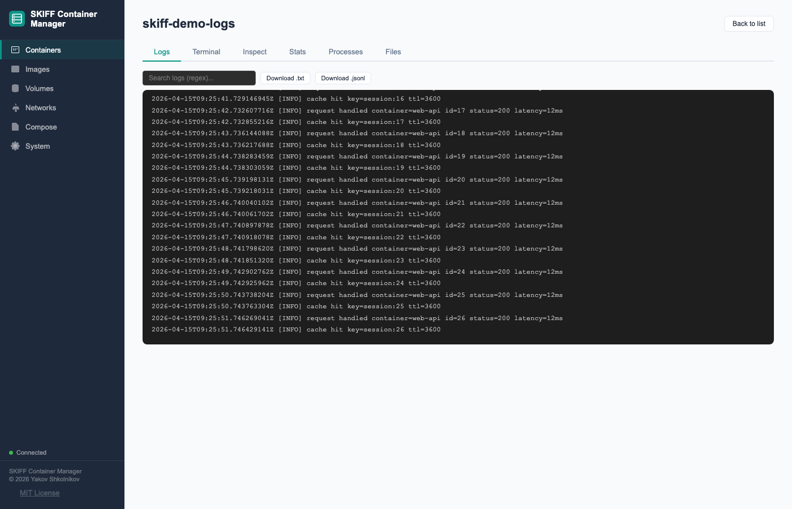
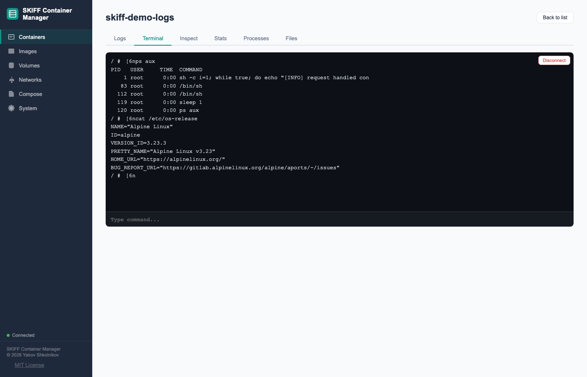

# SKIFF Container Manager

A lightweight web UI for Docker — works locally on your machine alongside any container runtime, or remotely over SSH. No agent, no daemon, no installation on the Docker host.

Registry allowlists, compose sandboxing, audit logging, WebSocket log streaming, and a browser UI that clears credentials on tab close. No per-seat licensing.






---

## Why SKIFF?

SKIFF connects to any container daemon that speaks the Docker API — Docker Engine, Podman, Colima, OrbStack, Rancher Desktop, or a remote VM over SSH. It runs as a plain Python process: point it at a local socket for local container management, or at an SSH-tunnelled socket for a remote host.

Most container management UIs run as a container on the container host and reach the daemon by mounting `/var/run/docker.sock`. That works, but it has costs that matter on both laptops and cloud hosts:

- **`docker.sock` is root.** A container with socket access can start privileged containers, escape to the host filesystem, or terminate any workload. Security teams regularly flag this; the mitigation (a socket-proxy container) adds another thing to run and maintain.
- **Always-on management plane.** A server-based manager needs a dedicated process or VM running 24/7 — extra cost, another system to patch, a single point of failure.
- **No nested virtualisation needed.** Cloud workstations are VMs themselves. Running containers *inside* them requires nested virt, which not all SKUs support and many security policies prohibit.

SKIFF sidesteps all three: it runs as a plain Python process, the socket is forwarded over SSH (never mounted anywhere), and there is no idle management server.

| Concern | Desktop GUI tools | Server-based manager | SKIFF |
|---|---|---|---|
| Cost | Free (personal) or per-seat commercial | Dedicated management VM / container | Free, MIT |
| API access | GUI only | Yes | Yes — full REST API + audit log |
| `docker.sock` exposure | Mounted locally | Mounted into a privileged container | Forwarded over SSH — never mounted |
| Always-on cost | Must be open | Dedicated management VM required | Start when needed; stop when done |
| Registry controls | None built-in | Varies | Allowlist enforced server-side |
| Agent on container host | Not applicable | Required for remote hosts | None — SSH ControlMaster is the transport |
| Per-user RBAC | None | Supported (some tools) | Single token by default; place an [SSO proxy](SECURITY.md#6-sso-via-identity-proxy-optional-multi-user) in front for per-user identity |

### Zero trust and cloud workstation environments

Most container management tools assume implicit trust at the network layer — if you can reach the management plane, you can do anything. SKIFF is designed for environments where that assumption doesn't hold. There is no persistent trusted process on the container host: access is established per-session over SSH, authenticated at the identity layer your organisation already controls (IAP, BeyondCorp, SSH certificates, or any OIDC-aware proxy). The registry allowlist and compose sandboxing enforce least-privilege at the API layer regardless of who is connected, and every action is recorded in a structured audit log.

The alternative approaches each carry a cost that matters in this context. Tools that run as a container on the host require `docker.sock` access — which is effectively root on the host — and a persistent management VM that becomes part of your attack surface. Editor plugins that support remote Docker hosts give developers full daemon access with no guardrails: any image from any registry, any compose configuration including privileged containers. SKIFF sits between these: a full-featured browser UI with the registry controls, compose sandboxing, and audit trail that neither approach provides.

---

## Features

- **Container lifecycle** — list, run, start, stop, restart, pause, unpause, kill, rename, remove
- **Logs** — tail, search, download, stream via WebSocket; filter by `since`/`until` timestamp
- **Shell access** — interactive exec terminal via WebSocket
- **Images** — list, pull, push (approved registries only), tag, remove, inspect
- **Volumes** — create, delete, prune (named volumes only)
- **Networks** — create, delete, connect/disconnect containers, prune
- **Compose** — deploy and tear down stacks; sandbox-validated before execution
- **System** — container engine info, disk usage, prune all / build cache
- **Security** — Bearer token auth, CSRF protection, registry allowlist, rate limiting, security headers, audit logging

---

## Prerequisites

| Requirement | Minimum | Notes |
|---|---|---|
| Python | 3.12+ | |
| Docker CLI or equivalent | 24+ | For compose commands |
| Docker Engine or equivalent | 24+ | Local or remote |
| pip / venv | any | `run.sh` creates a venv automatically |

---

## Quick start

### Local use (Colima / OrbStack / Rancher Desktop / Docker Engine)

```bash
git clone https://github.com/yshk-mxim/skiff-container-manager skiff
cd skiff
cp .env.example .env   # API_TOKEN= and DOCKER_HOST are pre-filled for localhost
./run.sh
# Opens http://127.0.0.1:8080
```

`run.sh` creates a `.venv/` virtual environment and installs all dependencies automatically.

> **Zero-config dev mode** (localhost only, no auth):
> ```bash
> API_TOKEN="" uvicorn skiff.app:app --host 127.0.0.1 --port 8080
> ```
> Leave `API_TOKEN` empty only when binding to localhost — anyone with localhost access can use the UI.

### Platform socket paths

| Runtime | `DOCKER_HOST` value |
|---|---|
| Mac/Win default socket | `unix:///var/run/docker.sock` |
| Colima | `unix://$HOME/.colima/default/docker.sock` |
| OrbStack | `unix:///var/run/docker.sock` |
| Rancher Desktop | `unix://$HOME/.rd/docker.sock` |
| Linux Docker Engine | `unix:///var/run/docker.sock` |
| Remote via SSH | `unix:///tmp/docker.sock` (after tunnel — see [Remote deployment](#remote-deployment)) |

### Alternative: install from git without cloning

```bash
pip install git+https://github.com/yshk-mxim/skiff-container-manager

export API_TOKEN="$(openssl rand -hex 32)"
export DOCKER_HOST="unix:///var/run/docker.sock"
skiff
# Opens http://127.0.0.1:8080
```

### Remote deployment

For SSH tunnel setup (remote VMs, GCP Cloud Workstations, EC2, bare metal):

```bash
# Forward the remote socket
ssh -fNL /tmp/docker.sock:/var/run/docker.sock user@docker-host

export API_TOKEN="$(openssl rand -hex 32)"
export DOCKER_HOST="unix:///tmp/docker.sock"
./run.sh
```

See [docs/deployment.md](docs/deployment.md) for full remote setup, systemd configuration, and environment variable reference.

---

## Configuration

Copy `.env.example` to `.env` and edit. All values can also be set as environment variables directly.

| Variable | Default | Description |
|---|---|---|
| `API_TOKEN` | _(none)_ | Bearer token for API auth. Leave unset only for local dev. |
| `DOCKER_HOST` | `unix:///var/run/docker.sock` | Socket path for the container daemon. Recognised by any Docker-API-compatible runtime (Docker Engine, Podman, Colima, etc.) — not Docker-specific. Set to your local socket or SSH-tunnelled socket path. |
| `ALLOWED_REGISTRIES` | `docker.io,ghcr.io` | Comma-separated registry prefixes. Images outside these are rejected. Leave empty to allow all registries (dev only). |
| `ALLOWED_ORIGINS` | `http://127.0.0.1:8080` | Comma-separated CORS origins. |
| `BIND_HOST` | `127.0.0.1` | Address uvicorn listens on. |
| `PORT` | `8080` | Port uvicorn listens on (run.sh only). |
| `DOCKER_VM_HOST` | _(empty)_ | Hostname shown for container port links in the UI. |
| `COMPOSE_DIR` | `/data/compose` | Directory where compose files are stored on the server. |
| `AUDIT_LOG` | `/var/log/skiff-audit.jsonl` | Audit log path. Set to a writable path (e.g. `./audit.jsonl`). |
| `AUDIT_MAX_MB` | `10` | Max size per audit log file in MB. Increase for longer retention (e.g. `200` for ~1-year at moderate traffic). |
| `AUDIT_BACKUP_COUNT` | `5` | Number of rotated audit log files to keep. Total retention ≈ `AUDIT_MAX_MB × AUDIT_BACKUP_COUNT`. |
| `GOOGLE_CLOUD_PROJECT` | _(empty)_ | GCP project ID. When set (and `google-cloud-logging` installed via `pip install skiff[gcp]`), all audit log entries are dual-written to GCP Cloud Logging. |
| `GCP_LOG_NAME` | `skiff-audit` | Cloud Logging log name (only used when `GOOGLE_CLOUD_PROJECT` is set). |
| `RATE_LIMIT_SCALE` | `1` | Multiply all rate limits by this factor (e.g. `100` for CI / load tests). Must be between 1 and 100. |

---

## API

See [docs/api-reference.md](docs/api-reference.md) for the full endpoint reference.

| Prefix | Resource |
|---|---|
| `GET /health` | Liveness probe (no auth) |
| `GET /ready` | Readiness — returns 503 if container daemon unreachable (no auth) |
| `GET /api/auth-required` | Auth config for the UI (no auth) |
| `/api/containers/...` | Container lifecycle, logs, inspect, stats |
| `/api/images/...` | Image operations |
| `/api/volumes/...` | Volume operations |
| `/api/networks/...` | Network operations |
| `/api/compose/...` | Compose stacks |
| `/api/registry/...` | Docker Hub search and tag lookup |
| `/api/system/...` | System info, prune, and audit log |
| `/api/config` | Server config returned to the UI |
| `WS /ws/logs/{id}` | Stream container logs |
| `WS /ws/exec/{id}` | Interactive shell |

All `/api/` endpoints require `Authorization: Bearer <token>`.  
Mutating endpoints (`POST`, `DELETE`) also require `X-Requested-With: ContainerManager`.

---

## Deployment (systemd)

A systemd unit file is provided at `docs/skiff.service`. To install:

```bash
sudo cp docs/skiff.service /etc/systemd/system/skiff@.service
sudo systemctl daemon-reload
sudo systemctl enable --now skiff@$USER
sudo journalctl -u skiff@$USER -f
```

The service reads configuration from `/opt/skiff/.env`.

---

## Development

```bash
git clone https://github.com/yshk-mxim/skiff-container-manager skiff
cd skiff
python3 -m venv .venv && source .venv/bin/activate

# Unit tests — no container daemon required
pip install -e .[dev]
make test-unit

# Run with hot-reload
cp .env.example .env   # set API_TOKEN="" for no-auth dev mode
API_TOKEN="" uvicorn skiff.app:app --reload --host 127.0.0.1 --port 8080
```

```bash
make lint        # ruff check
make format      # ruff format + auto-fix
make test-unit   # fast unit tests (no container daemon required)
make test-e2e    # Playwright e2e (requires pip install -e .[dev,e2e] && playwright install chromium)
make coverage    # coverage report
make security    # ruff --select S security scan
make ci          # lint + security + unit tests
```

---

## Security

See [SECURITY.md](SECURITY.md) for the security model, design trade-offs, and vulnerability reporting process. See [docs/production-hardening.md](docs/production-hardening.md) for the operator deployment and hardening guide (TLS, token rotation, registry scoping, SSO, audit log retention, supply chain).

---

## License

MIT — see [LICENSE](LICENSE).
