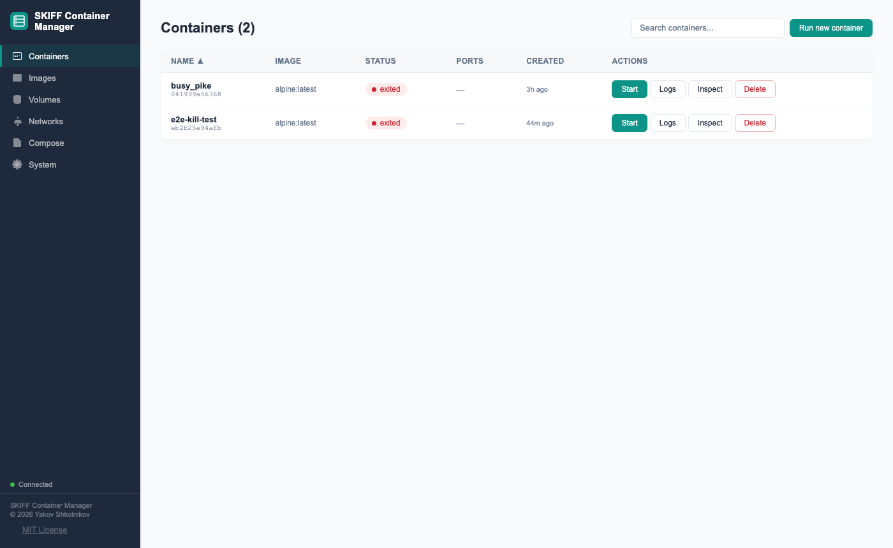

# SKIFF Container Manager

A lightweight web UI for managing containers. Built for teams running containers on remote VMs — GCP Cloud Workstations, EC2, bare metal — accessible securely over an SSH tunnel from anywhere with a browser.

No per-seat licensing. No installation on the container host. Works wherever you have a browser and SSH.



---

## Why SKIFF?

SKIFF connects to any container daemon that speaks the Docker API — Docker Engine, Podman, Colima, OrbStack, Rancher Desktop, or a remote VM over SSH. Its primary design target is teams using cloud workstations (GCP Cloud Workstations, AWS Dev Boxes, Azure Dev Box) who need to manage a remote container host without running a persistent management VM. In the remote case the socket is forwarded over SSH rather than mounted into a container, which is the key security difference described below.

Most container management UIs run as a container on the container host and reach the daemon by mounting `/var/run/docker.sock`. That works, but it has costs that matter in cloud environments:

- **`docker.sock` is root.** A container with socket access can start privileged containers, escape to the host filesystem, or terminate any workload. Security teams regularly flag this; the mitigation (a socket-proxy container) adds another thing to run and maintain.
- **Always-on management plane.** A server-based manager needs a dedicated VM running 24/7 — extra cost, another system to patch, a single point of failure, just to manage your other VMs.
- **No nested virtualisation needed.** Cloud workstations are VMs themselves. Running containers *inside* them requires nested virt, which not all SKUs support and many security policies prohibit.

SKIFF sidesteps all three: it runs as a plain Python process on your workstation, the socket is forwarded over SSH (never mounted anywhere), and there is no idle management server.

| Concern | Server-based manager | SKIFF |
|---|---|---|
| `docker.sock` exposure | Mounted into a privileged container on the host | Forwarded over SSH — never mounted |
| Always-on cost | Dedicated management VM required | Starts on your workstation; stop it when done |
| Nested virtualisation | Required if running on a cloud workstation | Not required — SKIFF is not a container |
| Agent on container host | Required for remote hosts | None — SSH ControlMaster is the transport |
| Multiple hosts | Supported (some tools) | One instance per host, each via its own SSH context |
| Per-user RBAC | Supported (some tools) | Single token by default; place an [SSO proxy](SECURITY.md#6-sso-via-identity-proxy-optional-multi-user) in front for per-user identity |

See [SECURITY.md](SECURITY.md) for the full security model, production hardening checklist, design trade-off notes, and vulnerability reporting process. Key controls: registry allowlist, compose/volume sandboxing, CSRF protection, WebSocket token-via-message, rate limiting, security headers, and structured audit logging.

---

## Features

- **Container lifecycle** — list, run, start, stop, restart, pause, unpause, kill, rename, remove
- **Logs** — tail, search, download, stream via WebSocket; filter by `since`/`until` timestamp
- **Shell access** — interactive exec terminal via WebSocket
- **Images** — list, pull, push (approved registries only), tag, remove, inspect
- **Volumes** — create, delete, prune (named volumes only)
- **Networks** — create, delete, connect/disconnect containers, prune
- **Compose** — deploy and tear down stacks; sandbox-validated before execution
- **System** — container engine info, disk usage, prune all / build cache
- **Security** — Bearer token auth, CSRF protection, registry allowlist, rate limiting, security headers, audit logging

---

## Prerequisites

| Requirement | Minimum | Notes |
|---|---|---|
| Python | 3.11+ | 3.12 recommended |
| Docker CLI | 24+ | For compose commands |
| Docker Engine | 24+ | Local or remote |
| pip / venv | any | `run.sh` creates a venv automatically |

---

## Quick start

### Option A — clone and run (recommended)

```bash
git clone https://github.com/yshk-mxim/skiff-container-manager skiff
cd skiff

cp .env.example .env
# Edit .env — set API_TOKEN and DOCKER_HOST at minimum

./run.sh
# Opens http://127.0.0.1:8080
```

`run.sh` creates a `.venv/` virtual environment and installs all dependencies automatically.

### Option B — pip install from git

```bash
pip install git+https://github.com/yshk-mxim/skiff-container-manager

# Configure via environment variables or a .env file in the working directory
export API_TOKEN="$(openssl rand -hex 32)"
export DOCKER_HOST="unix:///var/run/docker.sock"

skiff
# Opens http://127.0.0.1:8080
```

For platform-specific setup (Linux, macOS, WSL2, GCP Cloud Workstation, remote SSH tunnel) see [docs/deployment.md](docs/deployment.md).

---

## Configuration

Copy `.env.example` to `.env` and edit. All values can also be set as environment variables directly.

| Variable | Default | Description |
|---|---|---|
| `API_TOKEN` | _(none)_ | Bearer token for API auth. Leave unset only for local dev. |
| `DOCKER_HOST` | `unix:///var/run/docker.sock` | Socket path for the container daemon. Recognised by any Docker-API-compatible runtime (Docker Engine, Podman, Colima, etc.) — not Docker-specific. Set to your local socket or SSH-tunnelled socket path. |
| `ALLOWED_REGISTRIES` | `us-docker.pkg.dev/` | Comma-separated registry prefixes. Images outside these are rejected. |
| `ALLOWED_ORIGINS` | `http://127.0.0.1:8080` | Comma-separated CORS origins. |
| `BIND_HOST` | `127.0.0.1` | Address uvicorn listens on. |
| `PORT` | `8080` | Port uvicorn listens on (run.sh only). |
| `DOCKER_VM_HOST` | _(empty)_ | Hostname shown for container port links in the UI. |
| `COMPOSE_DIR` | `/data/compose` | Directory where compose files are stored on the server. |
| `AUDIT_LOG` | `/var/log/skiff-audit.jsonl` | Audit log path. Set to a writable path (e.g. `./audit.jsonl`). |
| `RATE_LIMIT_SCALE` | `1` | Multiply all rate limits by this factor (e.g. `100` for CI / load tests). |

---

## API

See [docs/api-reference.md](docs/api-reference.md) for the full endpoint reference.

| Prefix | Resource |
|---|---|
| `GET /health` | Liveness probe (no auth) |
| `GET /ready` | Readiness — returns 503 if container daemon unreachable (no auth) |
| `GET /api/auth-required` | Auth config for the UI (no auth) |
| `/api/containers/...` | Container lifecycle, logs, inspect, stats |
| `/api/images/...` | Image operations |
| `/api/volumes/...` | Volume operations |
| `/api/networks/...` | Network operations |
| `/api/compose/...` | Compose stacks |
| `/api/registry/...` | Docker Hub search and tag lookup |
| `/api/system/...` | System info, prune, and audit log |
| `/api/config` | Server config returned to the UI |
| `WS /ws/logs/{id}` | Stream container logs |
| `WS /ws/exec/{id}` | Interactive shell |

All `/api/` endpoints require `Authorization: Bearer <token>`.  
Mutating endpoints (`POST`, `DELETE`) also require `X-Requested-With: ContainerManager`.

---

## Deployment (systemd)

A systemd unit file is provided at `docs/skiff.service`. To install:

```bash
sudo cp docs/skiff.service /etc/systemd/system/skiff@.service
sudo systemctl daemon-reload
sudo systemctl enable --now skiff@$USER
sudo journalctl -u skiff@$USER -f
```

The service reads configuration from `/opt/skiff/.env`.

---

## Development

```bash
git clone https://github.com/yshk-mxim/skiff-container-manager skiff
cd skiff
python3 -m venv .venv && source .venv/bin/activate

# Unit tests — no container daemon required
pip install -e .[dev]
make test-unit

# Run with hot-reload
cp .env.example .env   # set API_TOKEN="" for no-auth dev mode
API_TOKEN="" uvicorn skiff.app:app --reload --host 127.0.0.1 --port 8080
```

```bash
make lint        # ruff check
make format      # ruff format + auto-fix
make test-unit   # fast unit tests (no Docker required)
make test-e2e    # Playwright e2e (requires pip install -e .[dev,e2e] && playwright install chromium)
make coverage    # coverage report
make security    # bandit-equivalent security scan
make ci          # lint + security + unit tests
```

---

## License

MIT — see [LICENSE](LICENSE).
